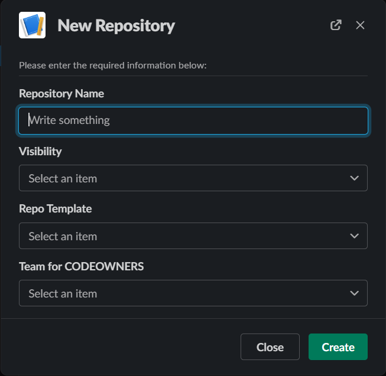

# slack-gitbot
slack-gitbot is a tool for controlling the creation of github repositories through chatops



## Environmental Variables

The following environmental variables must be set.

| Variable Name | Secret | Description |
| ------------- | ------ | ----------- |
| SLACK_BOT_TOKEN | True | The Slack bot token from the oauth tab of the bot configuration page in slack (`xoxb-<something>`) |
| SLACK_SIGNING_SECRET | True | The signing secret from the basic information page of the bot configuration page in slack |
| GITHUB_TOKEN | True | The github PAT used to create new repos |

## App Configuration
Configuration of all other variables is done via conf.yml. This can be set at container build time or runtime by overriding the `/app/conf.yml` file. At a minimum you must configure the `github.org` value. 

## Running
This project is designed to run as a container and can be run serverless. It has been tested on GCP Cloud Run specifically. 

## Slack Configuration
The first step to configure slack is to create a slack app:

https://api.slack.com/apps

You should modify and the `app_manifest.yml` to set the slack permissions, making sure to uncomment the permissions required to use azure-ad authentication if you want to use it. If you aren't a slack admin, you'll have to request for the app to be installed to your workspace.

## Github Configuration
You will need to provide a Github personal access token, preferably for a service account, with `org:admin` access. This PAT should be passed to slack-gitbot via the `GITHUB_TOKEN` environmental variable.

## Authentication
### Azure-AD
You will find an authentication provider for Azure AD in the `auth_providers` folder. It requires an Azure AD enterprise application to be configured with certificate based auth. You can enable Azure AD auth by configuring `slackbot.auth` to `azure-ad-auth` in the `conf.yml` file and uncommenting the `azure_ad_group` section in the `conf.yml` file.

If `cert_dir` is set to `/secrets` then the bot will look for the application certificate in `/secrets/cert/cert.pem` and the private key in `/secrets/key/key.pem`. It's designed to work this way to make working with secrets managers (like GCP Secrets) more easily. 

### Build cert for Azure AD
Make a certs directory and change to it

```shell
mkdir certs && cd certs
```

Create a key and a cert that expires in 1 year
```shell
openssl req -x509 -nodes -newkey rsa:4096 -keyout key.pem -out cert.pem -sha256 -days 365
```